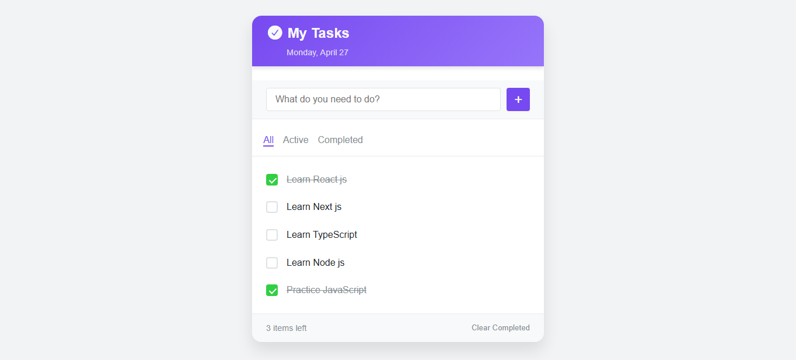

# 📝 Todo App

A modern and responsive Todo App built with **Vanilla JavaScript, HTML, and CSS**.

This project was created to practice real-world frontend development concepts such as:

- DOM Manipulation
- Event Handling
- Local Storage
- Dynamic Rendering
- Filtering Todos
- Inline Editing
- Clean JavaScript Architecture

---

## 🚀 Features

- ➕ Add new tasks
- ✅ Mark tasks as completed
- 🗑 Delete tasks
- ✏️ Inline editing with double click
- 🔍 Filter tasks (All / Active / Completed)
- 🧹 Clear completed tasks
- 💾 Persistent data using LocalStorage
- 📱 Responsive UI

---

## 🧠 Concepts Practiced

This project focuses on understanding core JavaScript concepts deeply without using frameworks.

### Key Concepts:

- Array Methods (`filter`, `forEach`)
- State Management
- Event Handling
- DOM Rendering
- Dynamic Element Creation
- UI State Synchronization
- Clean Event Flow
- Single Responsibility Principle

---

## 🛠 Technologies Used

- HTML5
- CSS3
- JavaScript (ES6)

---

## 📂 Project Structure

```bash
todo-app/
│
├── assets/
│   └── screenshot.png
│
├── index.html
├── style.css
├── script.js
└── README.md
```

---

## 💡 What I Learned

While building this project, I improved my understanding of:

- How modern UI rendering works
- Managing application state with JavaScript
- Building reusable logic
- Structuring code cleanly
- Handling user interactions efficiently

---

## 🌐 Live Demo

🚀 Live Preview:

```bash
https://habibtamkinfx.github.io/todo-app/
```

---

## 📸 Screenshot



---

## 👨‍💻 Author

Built by Habibullah Tamkin

GitHub:

```bash
https://github.com/habibtamkinfx
```
